# R2/V11 仕様（ドラフト）

## 全体フロー

```
画像 ──→ ColorExtractionPort.extract() ──→ OklchColor[16]
                                              │
                                        UI: ユーザーが 2〜3 色タップ
                                              │
                                              ▼
                                        SymbolicColor[2..3]
                                              │
              ┌───────────────────────────────┤
              ▼                               ▼
  ColorHarmonyService               NeutralScaleService
  .buildAccentPalette()             .generate()
              │                               │
              ▼                               ▼
  AccentPalette (8色)              NeutralScale (10段階)
              │                               │
              └───────────┬───────────────────┘
                          │
                          ▼
              ContrastGuardService
              .enforceAll(palette, neutral, diagnostics)
                          │
                          ▼
              RoleAssignmentService
              .assign(palette, neutral, diagnostics)
                          │
                          ▼
                    HighlightMap (66+ groups)
                          │
                          ▼
              ThemeOutputPort.output()
```

---

## ドメインモデル図

```mermaid
classDiagram
    direction TB

    %% ══════════════════════════════════
    %% 値オブジェクト
    %% ══════════════════════════════════

    class OklchColor {
        <<Value Object>>
        -h: number  0~360
        -l: number  0~1
        -c: number  0~0.4
        -constructor(h, l, c)
        +create(h, l, c)$ OklchColor
        +withL(l) OklchColor
        +withScaledC(factor, min, max) OklchColor
        +deltaE(other) number
        +deltaHue(other) number
        +contrastRatio(other) number
        +equals(other) boolean
        -relativeLuminance() number
    }

    class SymbolicColor {
        <<Value Object>>
        -color: OklchColor
        -source: SelectionSource
        -constructor(color, source)
        +create(color, source)$ SymbolicColor
        +hue() number
        +chroma() number
    }

    class HighlightDef {
        <<Value Object>>
        -fg?: OklchColor
        -bg?: OklchColor
        -bold?: boolean
        -italic?: boolean
        -undercurl?: boolean
        -sp?: OklchColor
        +create(props)$ HighlightDef
    }

    class DiagnosticColors {
        <<Value Object>>
        -error: OklchColor
        -warn: OklchColor
        -info: OklchColor
        -hint: OklchColor
        -diffAdd: OklchColor
        -diffDelete: OklchColor
        -diffChange: OklchColor
        +DEFAULT$ DiagnosticColors
    }

    class SelectionSource {
        <<enumeration>>
        user-selected
        auto-recommended
    }

    %% ══════════════════════════════════
    %% 集約
    %% ══════════════════════════════════

    class AccentPalette {
        <<Aggregate Root>>
        -colors: OklchColor[8]
        -constructor(colors)
        +create(colors)$ AccentPalette
        +get(index) OklchColor
        +withReplacedColor(i, color) AccentPalette
        +minDeltaE() number
    }
    note for AccentPalette "不変条件:\n- 常に 8 色\n- 全ペア ΔE ≥ MIN_DELTA_E\n- diagnostic と ΔH ≥ 30°"

    class NeutralScale {
        <<Aggregate>>
        -hue: number
        -chroma: number
        -bgDark: OklchColor
        -bg: OklchColor
        -surface: OklchColor
        -border: OklchColor
        -visual: OklchColor
        -muted: OklchColor
        -comment: OklchColor
        -fgDim: OklchColor
        -fg: OklchColor
        -fgBright: OklchColor
        -constructor(...)
        +create(hue, seedChroma)$ NeutralScale
        +withAdjustedStep(name, color) NeutralScale
    }
    note for NeutralScale "不変条件:\n- L は単調増加\n- 全ステップ ΔH ≤ 15°"

    class HighlightMap {
        <<Aggregate>>
        -groups: Map~string, HighlightDef~
        -constructor(groups)
        +create(groups, normalBg)$ HighlightMap
        +get(name) HighlightDef
        +toRecord() Record
    }
    note for HighlightMap "不変条件:\n- syntax fg on bg ≥ 4.5:1\n- comment on bg ≥ 3:1"

    %% ══════════════════════════════════
    %% ドメインサービス
    %% ══════════════════════════════════

    class ColorHarmonyService {
        <<Domain Service>>
        +buildAccentPalette(seeds) AccentPalette
        -generateVariants(seed) OklchColor[]
        -generateIndependentHues(seeds) OklchColor[]
        -avoidDiagnosticHues(colors) OklchColor[]
    }

    class ContrastGuardService {
        <<Domain Service>>
        +ensureContrast(fg, bg, minRatio) OklchColor
        +enforceAll(palette, neutral, diagnostics) AdjustedResult
    }

    class RoleAssignmentService {
        <<Domain Service>>
        +assignRoles(adjusted, neutral, diagnostics) HighlightMap
    }

    class AdjustedPalette {
        <<Value Object>>
        -colors: OklchColor[8]
        +create(colors)$ AdjustedPalette
        +get(index) OklchColor
    }
    note for AdjustedPalette "コントラスト補正済み。\nAccentPalette の ΔE 不変条件は\n適用しない（補正で崩れうるため）"

    class AdjustedResult {
        <<Value Object>>
        +palette: AdjustedPalette
        +neutral: NeutralScale
        +diagnostics: DiagnosticColors
    }

    %% ══════════════════════════════════
    %% Port（interface）
    %% ══════════════════════════════════

    class ColorExtractionPort {
        <<interface>>
        +extract(image) Promise~OklchColor[]~
    }

    class ThemeOutputPort {
        <<interface>>
        +output(map, meta) string
    }

    class ThemeMeta {
        <<Value Object>>
        +name: string
        +variant: "dark"
    }

    %% ══════════════════════════════════
    %% UseCase
    %% ══════════════════════════════════

    class GenerateThemeUseCase {
        <<UseCase>>
        -outputPort: ThemeOutputPort
        +constructor(outputPort)
        +execute(seeds, meta) string
    }

    %% ══════════════════════════════════
    %% Gateway（Port の実装）
    %% ══════════════════════════════════

    class ColorthiefGateway {
        <<Gateway>>
        +extract(image) Promise~OklchColor[]~
    }

    class NeovimLuaGateway {
        <<Gateway>>
        +output(map, meta) string
    }

    %% ══════════════════════════════════
    %% リレーション
    %% ══════════════════════════════════

    %% 値オブジェクトの構成
    SymbolicColor *-- OklchColor : color
    SymbolicColor *-- SelectionSource : source
    DiagnosticColors *-- OklchColor : error/warn/info/hint/diff

    %% 集約の構成
    AccentPalette *-- "8" OklchColor : colors
    NeutralScale *-- "10" OklchColor : steps
    HighlightMap *-- "*" HighlightDef : groups

    %% ドメインサービスの依存
    ColorHarmonyService ..> SymbolicColor : 入力
    ColorHarmonyService ..> AccentPalette : 生成
    ColorHarmonyService ..> DiagnosticColors : 干渉回避参照

    ContrastGuardService ..> AccentPalette : 入力
    ContrastGuardService ..> AdjustedPalette : 生成
    ContrastGuardService ..> NeutralScale : bg 参照
    ContrastGuardService ..> DiagnosticColors : 検証
    ContrastGuardService ..> AdjustedResult : 出力
    ContrastGuardService ..> OklchColor : ensureContrast

    RoleAssignmentService ..> AdjustedPalette : 入力
    RoleAssignmentService ..> NeutralScale : 入力
    RoleAssignmentService ..> DiagnosticColors : 入力
    RoleAssignmentService ..> HighlightMap : 生成

    %% UseCase の依存
    GenerateThemeUseCase ..> ColorHarmonyService : uses
    GenerateThemeUseCase ..> ContrastGuardService : uses
    GenerateThemeUseCase ..> RoleAssignmentService : uses
    GenerateThemeUseCase --> ThemeOutputPort : DI

    %% Port の実装（依存性逆転）
    ColorthiefGateway ..|> ColorExtractionPort : implements
    NeovimLuaGateway ..|> ThemeOutputPort : implements

    %% ThemeOutputPort の依存
    ThemeOutputPort ..> HighlightMap : 入力
    ThemeOutputPort ..> ThemeMeta : 入力

    %% AdjustedResult の構成
    AdjustedResult *-- AdjustedPalette
    AdjustedResult *-- NeutralScale
    AdjustedResult *-- DiagnosticColors

    %% AdjustedPalette の構成
    AdjustedPalette *-- "8" OklchColor : colors
```



### レイヤー境界

```mermaid
graph TB
    subgraph Presentation["Presentation / UI"]
        Handler["Handler<br/>(Hono / atoms)"]
    end

    subgraph UseCase["UseCase"]
        GTUC["GenerateThemeUseCase"]
    end

    subgraph Domain["Domain（外部依存ゼロ）"]
        subgraph ValueObjects["値オブジェクト"]
            OC[OklchColor]
            SC[SymbolicColor]
            DC[DiagnosticColors]
            HD[HighlightDef]
        end
        subgraph Aggregates["集約"]
            AP[AccentPalette]
            NS[NeutralScale]
            HM[HighlightMap]
        end
        subgraph DomainServices["ドメインサービス"]
            CHS[ColorHarmonyService]
            CGS[ContrastGuardService]
            RAS[RoleAssignmentService]
        end
        subgraph Ports["Port（interface）"]
            CEP[ColorExtractionPort]
            TOP[ThemeOutputPort]
        end
    end

    subgraph Gateway["Gateway"]
        CG[ColorthiefGateway]
        NLG[NeovimLuaGateway]
    end

    subgraph Driver["Driver"]
        CT[colorthief]
        LUA[Lua 文字列生成]
    end

    Handler --> GTUC
    GTUC --> CHS
    GTUC --> CGS
    GTUC --> RAS
    GTUC -.-> TOP

    CHS --> AP
    CHS --> SC
    CGS --> AP
    CGS --> NS
    RAS --> HM

    CG -.->|implements| CEP
    NLG -.->|implements| TOP
    CG --> CT
    NLG --> LUA

    style Domain fill:#1a1a2e,stroke:#e94560,stroke-width:2px
    style Ports fill:#16213e,stroke:#0f3460,stroke-width:1px
    style Gateway fill:#0f3460,stroke:#533483,stroke-width:1px
```



---

## クラス設計図（テキスト版）

```
┌─────────────────────────────────────────────────────────────────┐
│  Domain Layer（外部依存ゼロ）                                     │
│                                                                 │
│  ── 値オブジェクト（不変・private constructor・create で生成）──    │
│                                                                 │
│  ┌─────────────────────────────────┐                            │
│  │ OklchColor                      │                            │
│  │─────────────────────────────────│                            │
│  │ - h: number  (0-360)            │                            │
│  │ - l: number  (0-1)              │                            │
│  │ - c: number  (0-0.4)            │                            │
│  │─────────────────────────────────│                            │
│  │ - constructor(h, l, c)          │ private                    │
│  │ + create(h, l, c): OklchColor   │ 不変条件を検証して生成       │
│  │ + withL(l): OklchColor          │ L を差し替えた新しい色       │
│  │ + withScaledC(f, min, max)      │ C をスケーリング            │
│  │ + deltaE(other): number         │ 知覚差                     │
│  │ + deltaHue(other): number       │ Hue 差 (0-180)             │
│  │ + contrastRatio(other): number  │ WCAG コントラスト比          │
│  │ + equals(other): boolean        │ 値の等価性                  │
│  └─────────────────────────────────┘                            │
│         ▲ 全てのドメインオブジェクトの基盤                        │
│         │                                                       │
│  ┌──────┴──────────────────────────┐                            │
│  │ SymbolicColor                   │ ユーザー選択の意味を持つ色   │
│  │─────────────────────────────────│                            │
│  │ - color: OklchColor             │                            │
│  │ - source: SelectionSource       │                            │
│  │─────────────────────────────────│                            │
│  │ - constructor(color, source)    │ private                    │
│  │ + create(color, source)         │                            │
│  │ + hue(): number                 │ color.h への委譲            │
│  │ + chroma(): number              │ color.c への委譲            │
│  └─────────────────────────────────┘                            │
│         │                                                       │
│  ┌──────┴──────────────────────────┐                            │
│  │ HighlightDef                    │ 1 グループの色定義          │
│  │─────────────────────────────────│                            │
│  │ - fg?: OklchColor               │                            │
│  │ - bg?: OklchColor               │                            │
│  │ - bold?: boolean                │                            │
│  │ - italic?: boolean              │                            │
│  │ - undercurl?: boolean           │                            │
│  │ - sp?: OklchColor               │                            │
│  └─────────────────────────────────┘                            │
│                                                                 │
│  ── 集約（private constructor・create で不変条件を検証）──        │
│                                                                 │
│  ┌─────────────────────────────────┐                            │
│  │ AccentPalette  《集約ルート》     │                            │
│  │─────────────────────────────────│                            │
│  │ - colors: OklchColor[8]         │                            │
│  │─────────────────────────────────│                            │
│  │ - constructor(colors)           │ private                    │
│  │ + create(colors): AccentPalette │ 不変条件を全て検証           │
│  │ + get(index): OklchColor        │ 個別アクセス                │
│  │ + withReplacedColor(i, c)       │ 1 色差し替えた新しい集約     │
│  │ + allPairsDeltaE(): number[]    │ 全ペアの ΔE               │
│  │ + minDeltaE(): number           │ 最小 ΔE                   │
│  │─────────────────────────────────│                            │
│  │ 不変条件:                        │                            │
│  │  - 常に 8 色                     │                            │
│  │  - 全ペア ΔE ≥ MIN_DELTA_E      │                            │
│  │  - diagnostic と ΔH ≥ 30°       │                            │
│  └─────────────────────────────────┘                            │
│                                                                 │
│  ┌─────────────────────────────────┐                            │
│  │ NeutralScale  《集約》           │                            │
│  │─────────────────────────────────│                            │
│  │ - hue: number                   │                            │
│  │ - chroma: number                │                            │
│  │ - bgDark: OklchColor            │                            │
│  │ - bg: OklchColor                │                            │
│  │ - surface: OklchColor           │                            │
│  │ - border: OklchColor            │                            │
│  │ - visual: OklchColor            │                            │
│  │ - muted: OklchColor             │                            │
│  │ - comment: OklchColor           │                            │
│  │ - fgDim: OklchColor             │                            │
│  │ - fg: OklchColor                │                            │
│  │ - fgBright: OklchColor          │                            │
│  │─────────────────────────────────│                            │
│  │ - constructor(...)              │ private                    │
│  │ + create(hue, chroma)           │ L 値から 10 ステップ生成     │
│  │ + withAdjustedStep(name, color) │ 1 ステップ差し替え           │
│  │─────────────────────────────────│                            │
│  │ 不変条件:                        │                            │
│  │  - L は単調増加                  │                            │
│  │  - 全ステップ ΔH ≤ 15°          │                            │
│  └─────────────────────────────────┘                            │
│                                                                 │
│  ┌─────────────────────────────────┐                            │
│  │ DiagnosticColors  《値オブジェクト》                           │
│  │─────────────────────────────────│                            │
│  │ - error: OklchColor  (H≈25)    │                            │
│  │ - warn: OklchColor   (H≈70)    │                            │
│  │ - info: OklchColor   (H≈230)   │                            │
│  │ - hint: OklchColor   (H≈170)   │                            │
│  │ - diffAdd: OklchColor (H≈145)  │                            │
│  │ - diffDelete: OklchColor (H≈25)│                            │
│  │ - diffChange: OklchColor (H≈230)│                           │
│  │─────────────────────────────────│                            │
│  │ + static readonly DEFAULT       │ 固定インスタンス             │
│  └─────────────────────────────────┘                            │
│                                                                 │
│  ┌─────────────────────────────────┐                            │
│  │ HighlightMap  《集約》           │                            │
│  │─────────────────────────────────│                            │
│  │ - groups: Map<string,           │                            │
│  │           HighlightDef>         │                            │
│  │─────────────────────────────────│                            │
│  │ - constructor(groups)           │ private                    │
│  │ + create(groups, normalBg)      │ 全 fg の contrast を検証    │
│  │ + get(name): HighlightDef       │                            │
│  │ + toRecord(): Record<...>       │ 出力用プリミティブ変換       │
│  │─────────────────────────────────│                            │
│  │ 不変条件:                        │                            │
│  │  - syntax fg on bg ≥ 4.5:1      │                            │
│  │  - comment on bg ≥ 3:1          │                            │
│  └─────────────────────────────────┘                            │
│                                                                 │
│  ── ドメインサービス（値オブジェクト/集約に属さない処理）──        │
│                                                                 │
│  ┌─────────────────────────────────┐                            │
│  │ ColorHarmonyService             │ 最重要ドメインロジック       │
│  │─────────────────────────────────│                            │
│  │ + buildAccentPalette(           │                            │
│  │     seeds: SymbolicColor[]      │ 2〜3 色                    │
│  │   ): AccentPalette              │                            │
│  │─────────────────────────────────│                            │
│  │ - generateVariants(seed)        │ 同系統バリエーション         │
│  │ - generateIndependentHues(seeds)│ 独立 Hue の調和色           │
│  │ - avoidDiagnosticHues(colors)   │ diagnostic 干渉回避         │
│  └─────────────────────────────────┘                            │
│                                                                 │
│  ┌─────────────────────────────────┐                            │
│  │ ContrastGuardService            │                            │
│  │─────────────────────────────────│                            │
│  │ + ensureContrast(               │ 1 色の補正                  │
│  │     fg, bg, minRatio            │                            │
│  │   ): OklchColor                 │                            │
│  │ + enforceAll(                   │ 全色一括検証・補正           │
│  │     palette, neutral,           │                            │
│  │     diagnostics                 │ neutral.bg を内部で参照     │
│  │   ): AdjustedResult             │                            │
│  └─────────────────────────────────┘                            │
│                                                                 │
│  ┌─────────────────────────────────┐                            │
│  │ RoleAssignmentService           │                            │
│  │─────────────────────────────────│                            │
│  │ + assignRoles(                  │                            │
│  │     adjusted, neutral,          │ AdjustedPalette を受け取る  │
│  │     diagnostics                 │                            │
│  │   ): HighlightMap               │                            │
│  └─────────────────────────────────┘                            │
│                                                                 │
└─────────────────────────────────────────────────────────────────┘

┌─────────────────────────────────────────────────────────────────┐
│  Port（interface のみ — Domain 層に配置）                         │
│                                                                 │
│  ┌─────────────────────────────────┐                            │
│  │ «interface»                     │                            │
│  │ ColorExtractionPort             │                            │
│  │─────────────────────────────────│                            │
│  │ + extract(image): Promise<      │                            │
│  │     OklchColor[]>               │                            │
│  └─────────────────────────────────┘                            │
│                                                                 │
│  ┌─────────────────────────────────┐                            │
│  │ «interface»                     │                            │
│  │ ThemeOutputPort                 │                            │
│  │─────────────────────────────────│                            │
│  │ + output(map, meta): string     │                            │
│  └─────────────────────────────────┘                            │
└─────────────────────────────────────────────────────────────────┘

┌─────────────────────────────────────────────────────────────────┐
│  Gateway Layer（Port を実装。外部ライブラリに依存）               │
│                                                                 │
│  ┌─────────────────────────────────┐                            │
│  │ ColorthiefGateway               │                            │
│  │ implements ColorExtractionPort  │                            │
│  │─────────────────────────────────│                            │
│  │ + extract(image): Promise<      │ colorthief → OklchColor[]  │
│  │     OklchColor[]>               │                            │
│  └─────────────────────────────────┘                            │
│                                                                 │
│  ┌─────────────────────────────────┐                            │
│  │ NeovimLuaGateway                │                            │
│  │ implements ThemeOutputPort      │                            │
│  │─────────────────────────────────│                            │
│  │ + output(map, meta): string     │ HighlightMap → Lua 文字列  │
│  └─────────────────────────────────┘                            │
└─────────────────────────────────────────────────────────────────┘

┌─────────────────────────────────────────────────────────────────┐
│  UseCase Layer                                                  │
│                                                                 │
│  ┌─────────────────────────────────┐                            │
│  │ GenerateThemeUseCase            │                            │
│  │─────────────────────────────────│                            │
│  │ - outputPort: ThemeOutputPort   │ DI で注入（Port のみ）      │
│  │─────────────────────────────────│                            │
│  │ + constructor(outputPort)       │                            │
│  │ + execute(seeds, meta): string  │ フローを組み立てるだけ       │
│  └─────────────────────────────────┘                            │
└─────────────────────────────────────────────────────────────────┘
```

### 依存関係

```
GenerateThemeUseCase
  ├──→ ColorHarmonyService      (Domain, 直接使用)
  ├──→ ContrastGuardService     (Domain, 直接使用)
  ├──→ RoleAssignmentService    (Domain, 直接使用)
  └──→ ThemeOutputPort          (Port, DI で注入)

ColorHarmonyService
  ├──→ OklchColor               (値オブジェクト)
  ├──→ SymbolicColor            (値オブジェクト)
  └──→ AccentPalette            (集約 — 生成品質ゲート)

ContrastGuardService
  ├──→ AccentPalette            (入力)
  ├──→ AdjustedPalette          (出力 — ΔE 不変条件なし)
  ├──→ NeutralScale             (bg 参照)
  └──→ DiagnosticColors

RoleAssignmentService
  ├──→ AdjustedPalette          (補正済み)
  ├──→ NeutralScale
  ├──→ DiagnosticColors
  └──→ HighlightMap             (集約)
```

---

## 1. 値オブジェクト

DDD ハンズオン本（@docs/references/books/ddd-hands-on/ chapter8）に従い、
`private constructor` + `create()` で不正な状態のインスタンスを防ぐ。

### OklchColor

全てのドメインロジックの基盤。不変。ビジネスルールを自身のメソッドとして持つ。

```typescript
class OklchColor {
  private constructor(
    readonly h: number,
    readonly l: number,
    readonly c: number,
  ) {}

  static create(h: number, l: number, c: number): OklchColor {
    if (l < 0 || l > 1) throw new Error("L must be 0-1");
    if (c < 0) throw new Error("C must be >= 0");
    return new OklchColor(((h % 360) + 360) % 360, l, c);
  }

  withL(l: number): OklchColor {
    return OklchColor.create(this.h, l, this.c);
  }

  withScaledC(factor: number, min: number, max: number): OklchColor {
    const scaled = Math.max(min, Math.min(max, this.c * factor));
    return OklchColor.create(this.h, this.l, scaled);
  }

  deltaE(other: OklchColor): number {
    // CIEDE2000 or OkLab ΔE
  }

  deltaHue(other: OklchColor): number {
    const diff = Math.abs(this.h - other.h);
    return Math.min(diff, 360 - diff);  // 0-180 の最短距離
  }

  contrastRatio(other: OklchColor): number {
    // sRGB relative luminance ベース（OkLch L ではない）
    const y1 = this.relativeLuminance();
    const y2 = other.relativeLuminance();
    const lighter = Math.max(y1, y2);
    const darker = Math.min(y1, y2);
    return (lighter + 0.05) / (darker + 0.05);
  }

  equals(other: OklchColor): boolean {
    return this.h === other.h && this.l === other.l && this.c === other.c;
  }

  private relativeLuminance(): number {
    // OkLch → sRGB → Y = 0.2126R + 0.7152G + 0.0722B
  }
}
```

**hex 変換 (toHex/fromHex) は Domain に属さない。** Gateway 層（ColorthiefGateway, NeovimLuaGateway）が
ColorConversionPort 経由で行う。gamut mapping（chroma reduction 方式）も Gateway の責務。

### SymbolicColor

ユーザーが選んだ象徴色。OklchColor をラップし、「ユーザーが選んだ」という意味を持たせる。

```typescript
type SelectionSource = "user-selected" | "auto-recommended";

class SymbolicColor {
  private constructor(
    readonly color: OklchColor,
    readonly source: SelectionSource,
  ) {}

  static create(color: OklchColor, source: SelectionSource): SymbolicColor {
    return new SymbolicColor(color, source);
  }

  get hue(): number { return this.color.h; }
  get chroma(): number { return this.color.c; }
}
```

### DiagnosticColors

画像非依存の固定色。全てのテーマで共通。

```typescript
class DiagnosticColors {
  private constructor(
    readonly error: OklchColor,
    readonly warn: OklchColor,
    readonly info: OklchColor,
    readonly hint: OklchColor,
    readonly diffAdd: OklchColor,
    readonly diffDelete: OklchColor,
    readonly diffChange: OklchColor,
  ) {}

  static readonly DEFAULT = new DiagnosticColors(
    OklchColor.create(25,  0.65, 0.18),  // error: 赤
    OklchColor.create(70,  0.75, 0.14),  // warn: 黄橙
    OklchColor.create(230, 0.70, 0.12),  // info: 青
    OklchColor.create(170, 0.70, 0.10),  // hint: シアン
    OklchColor.create(145, 0.22, 0.04),  // diffAdd: 暗緑（bg 用）
    OklchColor.create(25,  0.22, 0.04),  // diffDelete: 暗赤（bg 用）
    OklchColor.create(230, 0.22, 0.04),  // diffChange: 暗青（bg 用）
  );
}
```

### HighlightDef

1 ハイライトグループの色定義。

```typescript
class HighlightDef {
  private constructor(
    readonly fg?: OklchColor,
    readonly bg?: OklchColor,
    readonly bold?: boolean,
    readonly italic?: boolean,
    readonly undercurl?: boolean,
    readonly sp?: OklchColor,
  ) {}

  static create(props: {
    fg?: OklchColor; bg?: OklchColor;
    bold?: boolean; italic?: boolean;
    undercurl?: boolean; sp?: OklchColor;
  }): HighlightDef {
    return new HighlightDef(
      props.fg, props.bg, props.bold,
      props.italic, props.undercurl, props.sp,
    );
  }
}
```

---

## 2. 集約

DDD ハンズオン本（@docs/references/books/ddd-hands-on/ chapter10）に従い、
`create()` で不変条件を全て検証してからインスタンスを返す。

### AccentPalette

8 色アクセントパレット。集約ルートとして内部の整合性を保証する。

```typescript
class AccentPalette {
  private constructor(
    private readonly _colors: readonly OklchColor[],
  ) {}

  static create(colors: OklchColor[]): AccentPalette {
    if (colors.length !== 8) {
      throw new Error("AccentPalette must have exactly 8 colors");
    }

    // 全ペアの知覚差が閾値以上
    for (let i = 0; i < colors.length; i++) {
      for (let j = i + 1; j < colors.length; j++) {
        if (colors[i].deltaE(colors[j]) < MIN_DELTA_E) {
          throw new Error(`Colors ${i} and ${j} are too similar`);
        }
      }
    }

    // diagnostic 固定色との Hue 距離
    for (const color of colors) {
      for (const diagHue of DIAGNOSTIC_HUES) {
        if (color.deltaHue(diagHue) < MIN_DIAG_HUE_DISTANCE) {
          throw new Error("Color too close to diagnostic hue");
        }
      }
    }

    return new AccentPalette(Object.freeze([...colors]));
  }

  get(index: number): OklchColor {
    return this._colors[index];
  }

  withReplacedColor(index: number, color: OklchColor): AccentPalette {
    const newColors = [...this._colors];
    newColors[index] = color;
    return AccentPalette.create(newColors);  // 不変条件を再検証
  }

  minDeltaE(): number {
    let min = Infinity;
    for (let i = 0; i < 8; i++) {
      for (let j = i + 1; j < 8; j++) {
        min = Math.min(min, this._colors[i].deltaE(this._colors[j]));
      }
    }
    return min;
  }
}
```

定数（検証で確定）:

```
MIN_DELTA_E = 未確定（検証スクリプトで決定）
MIN_DELTA_E_FLOOR = 未確定（これ以下には絶対に緩和しない。知覚的に区別可能な下限）
MIN_DIAG_HUE_DISTANCE = 30°
DIAGNOSTIC_HUES = [25, 70, 230, 170]  // error, warn, info, hint
MAX_HARMONY_RETRIES = 5  // Step 5 の制約充足ループ上限
```

### NeutralScale

```typescript
class NeutralScale {
  private constructor(
    readonly hue: number,
    readonly chroma: number,
    readonly bgDark: OklchColor,
    readonly bg: OklchColor,
    readonly surface: OklchColor,
    readonly border: OklchColor,
    readonly visual: OklchColor,
    readonly muted: OklchColor,
    readonly comment: OklchColor,
    readonly fgDim: OklchColor,
    readonly fg: OklchColor,
    readonly fgBright: OklchColor,
  ) {}

  static create(hue: number, seedChroma: number): NeutralScale {
    const c = Math.max(0.01, Math.min(0.04, seedChroma * 0.15));
    const make = (l: number) => OklchColor.create(hue, l, c);

    const scale = new NeutralScale(
      hue, c,
      make(L_BG_DARK), make(L_BG), make(L_SURFACE), make(L_BORDER),
      make(L_VISUAL), make(L_MUTED), make(L_COMMENT), make(L_FG_DIM),
      make(L_FG), make(L_FG_BRIGHT),
    );

    // 不変条件: L の単調増加
    const steps = [
      scale.bgDark, scale.bg, scale.surface, scale.border, scale.visual,
      scale.muted, scale.comment, scale.fgDim, scale.fg, scale.fgBright,
    ];
    for (let i = 1; i < steps.length; i++) {
      if (steps[i].l <= steps[i - 1].l) {
        throw new Error("NeutralScale L must be monotonically increasing");
      }
    }

    return scale;
  }

  withAdjustedStep(
    name: keyof Omit<NeutralScale, "hue" | "chroma">,
    color: OklchColor,
  ): NeutralScale {
    // 1 ステップを差し替えた新しい NeutralScale を返す
    // create 内で不変条件を再検証
  }
}
```

L 値定数（検証スクリプトの結果で確定。以下は初期ターゲット）:

| 定数 | 初期値 | 用途 |
|------|--------|------|
| L_BG_DARK | 0.10 | popup 背景 |
| L_BG | 0.22 | Normal.bg |
| L_SURFACE | 0.26 | CursorLine, Pmenu |
| L_BORDER | 0.30 | FloatBorder, VertSplit |
| L_VISUAL | 0.34 | Visual, Search bg |
| L_MUTED | 0.42 | LineNr |
| L_COMMENT | 0.52 | Comment（3:1 閾値） |
| L_FG_DIM | 0.67 | 控えめなテキスト |
| L_FG | 0.87 | Normal.fg |
| L_FG_BRIGHT | 0.94 | 強調テキスト |

### HighlightMap

```typescript
class HighlightMap {
  private constructor(
    private readonly _groups: ReadonlyMap<string, HighlightDef>,
  ) {}

  static create(
    groups: Map<string, HighlightDef>,
    normalBg: OklchColor,
  ): HighlightMap {
    // 不変条件: fg を持つ全エントリが bg に対して WCAG 基準を満たす
    // HighlightDef が OklchColor ベースなので hex 変換不要
    for (const [name, def] of groups) {
      if (def.fg) {
        const bg = def.bg ?? normalBg;
        const required = SUBDUED_GROUPS.has(name) ? 3.0 : 4.5;
        if (def.fg.contrastRatio(bg) < required) {
          throw new Error(`${name}: contrast ratio below ${required}`);
        }
      }
    }
    return new HighlightMap(new Map(groups));
  }

  get(name: string): HighlightDef | undefined {
    return this._groups.get(name);
  }

  toRecord(): Record<string, HighlightDef> {
    return Object.fromEntries(this._groups);
  }
}
```

---

## 3. ドメインサービス

DDD ハンズオン本（@docs/references/books/ddd-hands-on/ chapter11）に従い、
値オブジェクトや集約に自然に属さない処理をドメインサービスとして分離する。

### ColorHarmonyService

プロダクトの最も重要なドメインロジック。象徴色から 8 色を生成する。

```typescript
class ColorHarmonyService {
  buildAccentPalette(seeds: SymbolicColor[]): AccentPalette {
    // Step 1〜5 を実行し、AccentPalette.create() で不変条件を検証
  }
}
```

**生成アルゴリズム**（plan.md §2 の制約内で。具体値は検証ループで詰める）:

```
入力: seeds[0] (必須), seeds[1] (必須), seeds[2] (任意)

Step 1: 象徴色から H を借用、L/C をロール要件で設定
  color[0] = { h: seeds[0].h, l: L_KEYWORD, c: scaleC(seeds[0].c, FACTOR_KEYWORD) }
  color[1] = { h: seeds[1].h, l: L_FUNCTION, c: scaleC(seeds[1].c, FACTOR_FUNCTION) }

Step 2: 同系統バリエーションを生成
  color[2] = variant(seeds[0], L_SPECIAL, FACTOR_VIVID)     // vivid variant
  color[3] = variant(seeds[1], L_TYPE, FACTOR_SUBDUED)      // subdued variant

Step 3: 独立 Hue の調和色を生成
  color[4] = independent(seeds, offset=60〜120, L_STRING)   // string
  color[5] = independent(seeds, offset=adjacent, L_NUMBER)  // number
  color[6] = independent(seeds, offset=complement, L_CONST) // constant
  color[7] = seeds[2] ありなら導出、なしなら中間 Hue         // preproc

Step 4: diagnostic 干渉回避
  for each color: if deltaHue(color, anyDiagHue) < 30°, shift hue

Step 5: 制約充足ループ（最大 MAX_HARMONY_RETRIES 回）
  try AccentPalette.create(colors)
  catch (ΔE 違反):
    違反ペアの L/C を微調整して再試行
    リトライ回数超過 → MIN_DELTA_E を段階的に緩和
    ただし MIN_DELTA_E_FLOOR 以下には絶対に緩和しない
  return AccentPalette
```

**L/C ターゲット定数**（検証スクリプトで確定。以下は初期値）:

```
// 全て L ≥ 0.72 に統一（Lea Verou 実測: 高 chroma でもコントラスト安全ゾーン）
// ロール間の差別化は L ではなく H/C で行う
L_KEYWORD  = 0.75
L_FUNCTION = 0.73
L_STRING   = 0.74
L_TYPE     = 0.72
L_NUMBER   = 0.73
L_CONST    = 0.72
L_SPECIAL  = 0.76  // vivid で目立たせる
L_PREPROC  = 0.72

FACTOR_KEYWORD = 0.85  // 象徴色の C × factor
FACTOR_VIVID   = 1.20  // 鮮やかめ
FACTOR_SUBDUED = 0.60  // 控えめ
```

### ContrastGuardService

生成された全色に対してコントラスト比を検証し、不足分を補正する。

```typescript
class ContrastGuardService {
  ensureContrast(fg: OklchColor, bg: OklchColor, minRatio: number): OklchColor {
    // 補正アルゴリズム（下記参照）
  }

  enforceAll(
    palette: AccentPalette,
    neutral: NeutralScale,
    diagnostics: DiagnosticColors,
  ): AdjustedResult {
    // AccentPalette → AdjustedPalette に変換（ΔE 不変条件を外す）
    // 各色を ensureContrast で補正
    // 補正後は AdjustedPalette として返す
  }
}
```

**補正アルゴリズム**:

```
1. ratio = fg.contrastRatio(bg)
2. if ratio >= minRatio → fg をそのまま返す（発火しない）

3. L を上方向に探索（step = 0.01, 上限 = 0.95）
   adjusted = fg.withL(fg.l + step)
   if adjusted.contrastRatio(bg) >= minRatio → adjusted を返す

4. L 調整幅が MAX_L_SHIFT (0.08) を超えた場合:
   C も同時に下げる: adjusted = adjusted.withScaledC(0.9, 0.03, fg.c)
   （色の印象を保つため、C を下げすぎない）

5. L = 0.95 でも不足 → fg.c を大幅に下げて再試行
   （事実上の最終手段。ほぼ発生しない想定）
```

**AdjustedPalette**: コントラスト補正済みの 8 色。AccentPalette の ΔE 不変条件は適用しない（補正で ΔE が崩れうるため）。

```typescript
class AdjustedPalette {
  private constructor(private readonly _colors: readonly OklchColor[]) {}

  static create(colors: OklchColor[]): AdjustedPalette {
    if (colors.length !== 8) throw new Error("Must have 8 colors");
    return new AdjustedPalette(Object.freeze([...colors]));
  }

  get(index: number): OklchColor { return this._colors[index]; }
}

type AdjustedResult = {
  readonly palette: AdjustedPalette;
  readonly neutral: NeutralScale;
  readonly diagnostics: DiagnosticColors;
};
```

| 対象 | bg | 閾値 |
|------|-----|------|
| accent 8 色 | neutral.bg | 4.5:1 |
| neutral.fg, fgBright, fgDim | neutral.bg | 4.5:1 |
| neutral.comment, muted | neutral.bg | 3:1 |
| diagnostic error/warn/info/hint | neutral.bg | 4.5:1 |

### RoleAssignmentService

補正済み 8 色 + neutral + semantic → 66+ ハイライトグループへの割り当て。

```typescript
class RoleAssignmentService {
  assignRoles(
    adjusted: AdjustedPalette,  // コントラスト補正済み
    neutral: NeutralScale,
    diagnostics: DiagnosticColors,
  ): HighlightMap {
    // 割り当てテーブルに従って HighlightMap を構築
    // HighlightMap.create() で WCAG 不変条件を検証
  }
}
```

**割り当てテーブル（ドラフト）**:

```
── syntax ──
Keyword     = adjusted[0]  (象徴色1 由来)
Function    = adjusted[1]  (象徴色2 由来)
Special     = adjusted[2]  (象徴色1 vivid variant)
Type        = adjusted[3]  (象徴色2 subdued variant)
String      = adjusted[4]  (独立 Hue)
Number      = adjusted[5]  (独立 Hue)
Constant    = adjusted[6]  (独立 Hue)
PreProc     = adjusted[7]  (中間 Hue)

── Treesitter ──
@keyword         = adjusted[0]
@keyword.return  = adjusted[0], bold
@function        = adjusted[1]
@function.call   = adjusted[1]
@string          = adjusted[4]
@string.escape   = adjusted[4], withL(+0.05)
@type            = adjusted[3]
@number          = adjusted[5]
@boolean         = adjusted[5]
@constant        = adjusted[6]
@variable        = neutral.fg (none)
@variable.member = adjusted[3], withL(-0.05)
@punctuation     = neutral.fgDim
@comment         = neutral.comment, italic
@tag             = adjusted[0]
@tag.attribute   = adjusted[3]
@attribute       = adjusted[6]
@namespace       = adjusted[0]

── UI 強調 ──
CursorLineNr = adjusted[2], bold  (special = vivid)
Search       = adjusted[2] bg, neutral.bg fg
IncSearch    = neutral.bg bg, adjusted[2] fg
Title        = adjusted[2], bold
TabLineSel   = adjusted[2], neutral.surface bg
Todo         = adjusted[2], bold

── neutral ──
Normal       = neutral.bg bg, neutral.fg fg
CursorLine   = neutral.surface bg
Pmenu        = neutral.surface bg, neutral.fg fg
PmenuSel     = neutral.visual bg, neutral.fgBright fg
StatusLine   = neutral.border bg, neutral.fg fg
Visual       = neutral.visual bg
Comment      = neutral.comment fg, italic
LineNr       = neutral.muted fg
FloatBorder  = neutral.border fg
Delimiter    = neutral.fgDim fg
NonText      = neutral.border fg

── semantic ──
DiagnosticError = diagnostics.error fg
DiagnosticWarn  = diagnostics.warn fg
DiagnosticInfo  = diagnostics.info fg
DiagnosticHint  = diagnostics.hint fg
DiffAdd         = diagnostics.diffAdd bg
DiffChange      = diagnostics.diffChange bg
DiffDelete      = diagnostics.diffDelete bg
```

**UI 強調色の方針**: `adjusted[2]`（象徴色1 の vivid variant = special）を UI 強調に使う。
syntax の keyword とは別の色（vivid で明るい）なので混同しない。

---

## 4. Port

Domain 層に配置する interface。実装は Gateway 層。

### ColorExtractionPort

```typescript
interface ColorExtractionPort {
  extract(image: ImageSource): Promise<OklchColor[]>;
}

type ImageSource = File | Blob | string;
```

### ThemeOutputPort

```typescript
interface ThemeOutputPort {
  output(map: HighlightMap, meta: ThemeMeta): string;
}

type ThemeMeta = {
  readonly name: string;
  readonly variant: "dark";
};
```

---

## 5. UseCase

DDD ハンズオン本（@docs/references/books/ddd-hands-on/ chapter13）に従い、
UseCase はドメインオブジェクトのメソッドを呼ぶシナリオのみを持つ。
ビジネスルールは書かない。

```typescript
class GenerateThemeUseCase {
  // DI は ThemeOutputPort のみ（ドメインサービスはステートレスなので DI 不要）
  constructor(private readonly outputPort: ThemeOutputPort) {}

  execute(seeds: SymbolicColor[], meta: ThemeMeta): string {
    // 1. 調和色生成（Domain）— AccentPalette（品質保証済み）
    const palette = new ColorHarmonyService().buildAccentPalette(seeds);

    // 2. neutral 生成（Domain）
    const neutral = NeutralScale.create(seeds[0].hue, seeds[0].chroma);

    // 3. diagnostic 固定色（Domain）
    const diagnostics = DiagnosticColors.DEFAULT;

    // 4. コントラスト検証・補正（Domain）— AdjustedPalette に変換
    const adjusted = new ContrastGuardService().enforceAll(palette, neutral, diagnostics);

    // 5. ロール割り当て（Domain）— AdjustedPalette を受け取る
    const map = new RoleAssignmentService().assignRoles(
      adjusted.palette, adjusted.neutral, adjusted.diagnostics,
    );

    // 6. テーマ出力（Port 経由。hex 変換は Gateway の責務）
    return this.outputPort.output(map, meta);
  }
}
```

色抽出は UseCase の外（UI 層）で行い、ユーザー選択を経て seeds として UseCase に渡す。

### DI 構成（Handler / Presentation 層）

```typescript
// 本番: Gateway を DI
const useCase = new GenerateThemeUseCase(new NeovimLuaGateway());

// テスト: モックを DI（ドメインサービスはモック不要。本物がそのまま動く）
const mockOutput: ThemeOutputPort = {
  output: (map, meta) => JSON.stringify(map.toRecord()),
};
const useCase = new GenerateThemeUseCase(mockOutput);
```

---

## 6. テスト戦略

### Domain テスト（必須・最優先）

| テスト対象 | テスト内容 | 手法 |
|-----------|-----------|------|
| OklchColor 関数群 | deltaE, deltaHue, contrastRatio の正確性 | 既知の色ペアで期待値検証 |
| toHex (gamut mapping) | 高 C で色相回転が起きないこと | H × C の全範囲で round-trip テスト |
| createAccentPalette | 不変条件の検証（8色, ΔE, Hue距離） | 正常系 + 違反系 |
| buildAccentPalette | kafka/topaz の象徴色で期待通りの 8 色が出ること | snapshot テスト |
| ensureContrast | 補正後に必ず minRatio 以上になること | property-based テスト（全 H × C） |
| NeutralScale | L の単調増加、Hue 保持 | 全ステップ検証 |

### UseCase テスト（モック DI）

```typescript
test("象徴色 2 色からテーマが生成される", async () => {
  const mockOutput: ThemeOutputPort = {
    output: (map, meta) => JSON.stringify(map),
  };

  const seeds: SymbolicColor[] = [
    { color: { h: 340, l: 0.55, c: 0.15 }, source: "user-selected" },  // kafka magenta
    { color: { h: 290, l: 0.74, c: 0.10 }, source: "user-selected" },  // kafka lavender
  ];

  const result = await generateTheme(seeds, mockExtraction, mockOutput, { name: "kafka", variant: "dark" });
  const map = JSON.parse(result);

  // syntax fg 全色が bg に対して WCAG AA
  for (const key of SYNTAX_GROUPS) {
    expect(contrastRatio(fromHex(map[key].fg), fromHex(map.Normal.bg))).toBeGreaterThanOrEqual(4.5);
  }
});
```

### 検証スクリプト（実装前に実行）

1. bg L=0.20〜0.24 に対して、各 L ターゲットで contrastRatio ≥ 4.5:1 を満たすか（H × C 全範囲）
2. ensureContrast 発火ケースの特定と L 調整幅分布
3. gamut mapping の round-trip 検証（toHex → fromHex で Hue が保持されるか）

---

## 未確定事項（検証ループで決定）

| 項目 | 初期値 | 決定方法 |
|------|--------|---------|
| bg の L 値 | 0.22 | VS Code dark との比較 + 目視 |
| neutral の C 導出式 | `C_sym * 0.15` | パステル/ビビッド両方で目視 |
| L ターゲット群 | §3 の表 | 検証スクリプト |
| C の factor/min/max | §3 の表 | kafka/topaz で目視 |
| MIN_DELTA_E | 未定 | 検証スクリプト |
| MIN_DELTA_E_FLOOR | 未定 | 知覚テスト（これ以下は絶対に緩和しない下限） |
| 独立 Hue のオフセット値 | 60〜120° | kafka/topaz から逆算 |
| MAX_L_SHIFT | 0.08 | 検証スクリプト |
