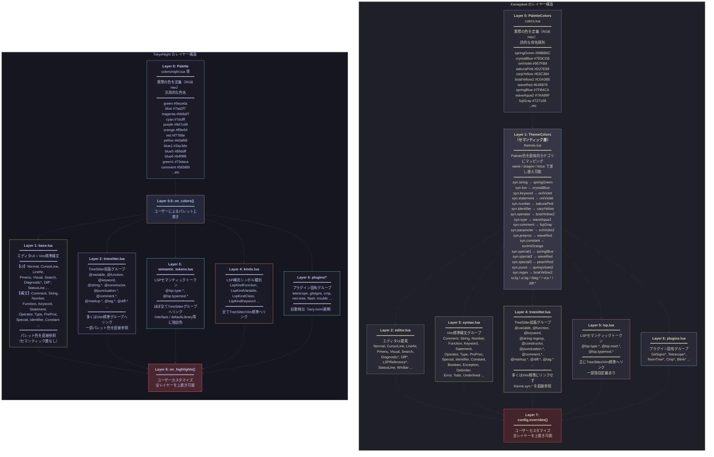

了解しました。前回の回答に漏れがあった部分を補完した、完全版の一覧表をそのまま表示します。

---

## 1. Vim標準ハイライトグループ（base/syntax層）完全版

Kanagawaは`syntax.lua`、TokyoNightは`base.lua`で定義されているもの全件です。

| 属性 | Kanagawa (wave) | TokyoNight (night) |
|------|----------------|-------------------|
| **Comment** | `syn.comment` → fujiGray `#727169` / italic | `c.comment` → `#565f89` / italic |
| **Constant** | `syn.constant` → surimiOrange `#FFA066` | `c.orange` → `#ff9e64` |
| **String** | `syn.string` → springGreen `#98BB6C` | `c.green` → `#9ece6a` |
| **Character** | link → String | `c.green` → `#9ece6a` |
| **Number** | `syn.number` → sakuraPink `#D27E99` | `c.orange` → `#ff9e64` |
| **Boolean** | `syn.constant` → surimiOrange `#FFA066` / bold | link → Number |
| **Float** | link → Number | link → Number |
| **Identifier** | `syn.identifier` → carpYellow `#E6C384` | `c.magenta` → `#bb9af7` / variablesスタイル |
| **Function** | `syn.fun` → crystalBlue `#7E9CD8` / functionStyle | `c.blue` → `#7aa2f7` / functionsスタイル |
| **Statement** | `syn.statement` → oniViolet `#957FB8` / bold | `c.magenta` → `#bb9af7` |
| **Operator** | `syn.operator` → boatYellow2 `#C0A36E` | `c.blue5` → `#89ddff` |
| **Keyword** | `syn.keyword` → oniViolet `#957FB8` / italic | `c.cyan` → `#7dcfff` / italic |
| **Exception** | `syn.special2` → waveRed `#E46876` | （明示定義なし、Statementにリンク） |
| **PreProc** | `syn.preproc` → waveRed `#E46876` | `c.cyan` → `#7dcfff` |
| **Type** | `syn.type` → waveAqua2 `#7AA89F` / typeStyle | `c.blue1` → `#2ac3de` |
| **Special** | `syn.special1` → springBlue `#7FB4CA` | `c.blue1` → `#2ac3de` |
| **Delimiter** | `syn.punct` → springViolet2 `#9CABCA` | link → Special |
| **Underlined** | `syn.special1` / underline | underline のみ |
| **Bold** | bold | bold, fg: `c.fg` |
| **Italic** | italic | italic, fg: `c.fg` |
| **Ignore** | link → NonText | （明示定義なし） |
| **Error** | `diag.error` → samuraiRed `#E82424` | `c.error` → `#db4b4b` |
| **Todo** | fg: `ui.fg_reverse`, bg: `diag.info` / bold | bg: `c.yellow`, fg: `c.bg` |
| **Debug** | （明示定義なし） | `c.orange` → `#ff9e64` |
| **markdownCode** | `syn.string` | （明示定義なし） |
| **markdownCodeBlock** | `syn.string` | （明示定義なし） |
| **markdownEscape** | fg: NONE | （明示定義なし） |
| **qfLineNr** | link → lineNr | `c.dark5` → `#737aa2` |
| **qfFileName** | link → Directory | `c.blue` → `#7aa2f7` |
| **htmlH1** | （明示定義なし） | `c.magenta` / bold |
| **htmlH2** | （明示定義なし） | `c.blue` / bold |
| **dosIniLabel** | （明示定義なし） | link → @property |
| **helpCommand** | （明示定義なし） | bg: `c.terminal_black`, fg: `c.blue` |

補足: Conditional, Repeat, Label, Include, Define, Macro, PreCondit, StorageClass, Structure, Typedef, SpecialChar, Tag, SpecialComment はどちらのテーマも明示定義しておらず、Vimのデフォルト動作で親グループにリンクされます。

---

## 2. TreeSitter拡張グループ 完全版

Kanagawaは`treesitter.lua`、TokyoNightは`treesitter.lua`で**明示的にコードとして定義行がある**もの全件です。

### 2-A. variable系

| 属性 | Kanagawa (wave) | TokyoNight (night) |
|------|----------------|-------------------|
| **@variable** | `ui.fg` → fujiWhite `#DCD7BA` | `c.fg` → `#c0caf5` / variablesスタイル |
| **@variable.builtin** | `syn.special2` → waveRed `#E46876` / italic | `c.red` → `#f7768e` |
| **@variable.parameter** | `syn.parameter` → oniViolet2 | `c.yellow` → `#e0af68` |
| **@variable.member** | `syn.identifier` → carpYellow `#E6C384` | `c.green1` → `#73daca` |
| **@variable.parameter.builtin** | （明示定義なし） | blend(`c.yellow`, 0.8) |

### 2-B. string系

| 属性 | Kanagawa (wave) | TokyoNight (night) |
|------|----------------|-------------------|
| **@string** | （明示定義なし、Vim標準Stringにリンク） | link → String |
| **@string.regexp** | `syn.regex` | `c.blue6` → `#b4f9f8` |
| **@string.escape** | `syn.regex` / bold | `c.magenta` → `#bb9af7` |
| **@string.special.symbol** | `syn.identifier` → carpYellow `#E6C384` | （明示定義なし） |
| **@string.special.url** | `syn.special1` → springBlue `#7FB4CA` / undercurl | （明示定義なし） |
| **@string.documentation** | （明示定義なし） | `c.yellow` → `#e0af68` |

### 2-C. constant / number / boolean系

| 属性 | Kanagawa (wave) | TokyoNight (night) |
|------|----------------|-------------------|
| **@constant** | （明示定義なし、Vim標準Constantにリンク） | link → Constant |
| **@constant.builtin** | （明示定義なし） | link → Special |
| **@constant.macro** | （明示定義なし） | link → Define |
| **@boolean** | （明示定義なし） | link → Boolean |
| **@number** | （明示定義なし） | link → Number |
| **@number.float** | （明示定義なし） | link → Float |
| **@character** | （明示定義なし） | link → Character |
| **@character.printf** | （明示定義なし） | link → SpecialChar |
| **@character.special** | （明示定義なし） | link → SpecialChar |

### 2-D. function系

| 属性 | Kanagawa (wave) | TokyoNight (night) |
|------|----------------|-------------------|
| **@function** | （明示定義なし、Vim標準Functionにリンク） | link → Function |
| **@function.builtin** | （明示定義なし） | link → Special |
| **@function.call** | （明示定義なし） | link → @function |
| **@function.macro** | （明示定義なし） | link → Macro |
| **@function.method** | （明示定義なし） | link → Function |
| **@function.method.call** | （明示定義なし） | link → @function.method |

### 2-E. keyword系

| 属性 | Kanagawa (wave) | TokyoNight (night) |
|------|----------------|-------------------|
| **@keyword** | （明示定義なし、Vim標準Keywordにリンク） | `c.purple` → `#9d7cd8` / italic |
| **@keyword.function** | （明示定義なし） | `c.magenta` → `#bb9af7` / functionsスタイル |
| **@keyword.operator** | `syn.operator` → boatYellow2 `#C0A36E` / bold | link → @operator |
| **@keyword.import** | link → PreProc | link → Include |
| **@keyword.return** | `syn.special3` → peachRed `#FF5D62` / keywordStyle | link → @keyword |
| **@keyword.exception** | `syn.special3` → peachRed `#FF5D62` / statementStyle | link → Exception |
| **@keyword.conditional** | （明示定義なし） | link → Conditional |
| **@keyword.coroutine** | （明示定義なし） | link → @keyword |
| **@keyword.debug** | （明示定義なし） | link → Debug |
| **@keyword.directive** | （明示定義なし） | link → PreProc |
| **@keyword.directive.define** | （明示定義なし） | link → Define |
| **@keyword.repeat** | （明示定義なし） | link → Repeat |
| **@keyword.storage** | （明示定義なし） | link → StorageClass |
| **@keyword.luap** | link → @string.regex | （明示定義なし） |

### 2-F. type / attribute / module系

| 属性 | Kanagawa (wave) | TokyoNight (night) |
|------|----------------|-------------------|
| **@type** | （明示定義なし、Vim標準Typeにリンク） | link → Type |
| **@type.builtin** | （明示定義なし） | blend(`c.blue1`, 0.8) |
| **@type.definition** | （明示定義なし） | link → Typedef |
| **@type.qualifier** | （明示定義なし） | link → @keyword |
| **@attribute** | link → Constant | link → PreProc |
| **@annotation** | （明示定義なし） | link → PreProc |
| **@module** | （明示定義なし） | link → Include |
| **@module.builtin** | （明示定義なし） | `c.red` → `#f7768e` |
| **@namespace.builtin** | （明示定義なし） | link → @variable.builtin |
| **@label** | （明示定義なし） | `c.blue` → `#7aa2f7` |

### 2-G. constructor / operator系

| 属性 | Kanagawa (wave) | TokyoNight (night) |
|------|----------------|-------------------|
| **@constructor** | `syn.special1` → springBlue `#7FB4CA` | `c.magenta` → `#bb9af7` |
| **@constructor.lua** | `syn.keyword` → oniViolet `#957FB8` | （明示定義なし） |
| **@constructor.tsx** | （明示定義なし） | `c.blue1` → `#2ac3de` |
| **@operator** | link → Operator | `c.blue5` → `#89ddff` |

### 2-H. punctuation系

| 属性 | Kanagawa (wave) | TokyoNight (night) |
|------|----------------|-------------------|
| **@punctuation.delimiter** | `syn.punct` → springViolet2 `#9CABCA` | `c.blue5` → `#89ddff` |
| **@punctuation.bracket** | `syn.punct` → springViolet2 `#9CABCA` | `c.fg_dark` → `#a9b1d6` |
| **@punctuation.special** | `syn.special1` → springBlue `#7FB4CA` | `c.blue5` → `#89ddff` |
| **@punctuation.special.markdown** | （明示定義なし） | `c.orange` → `#ff9e64` |

### 2-I. comment系

| 属性 | Kanagawa (wave) | TokyoNight (night) |
|------|----------------|-------------------|
| **@comment** | （明示定義なし、Vim標準Commentにリンク） | link → Comment |
| **@comment.error** | fg: `ui.fg`, bg: `diag.error` / bold | fg: `c.error` |
| **@comment.warning** | fg: `ui.fg_reverse`, bg: `diag.warning` / bold | fg: `c.warning` |
| **@comment.note** | fg: `ui.fg_reverse`, bg: `diag.hint` / bold | fg: `c.hint` |
| **@comment.todo** | （明示定義なし） | fg: `c.todo` |
| **@comment.hint** | （明示定義なし） | fg: `c.hint` |
| **@comment.info** | （明示定義なし） | fg: `c.info` |

### 2-J. markup系

| 属性 | Kanagawa (wave) | TokyoNight (night) |
|------|----------------|-------------------|
| **@markup** | （明示定義なし） | link → @none |
| **@markup.strong** | bold | bold |
| **@markup.italic** | italic | italic |
| **@markup.emphasis** | （明示定義なし） | italic |
| **@markup.strikethrough** | strikethrough | strikethrough |
| **@markup.underline** | underline | underline |
| **@markup.heading** | link → Function | link → Title |
| **@markup.heading.1~8.markdown** | （明示定義なし） | 各レベルごとにrainbow色 + bg + bold |
| **@markup.quote** | link → @variable.parameter | （明示定義なし） |
| **@markup.math** | link → Constant | link → Special |
| **@markup.environment** | link → Keyword | link → Macro |
| **@markup.environment.name** | （明示定義なし） | link → Type |
| **@markup.link** | （明示定義なし） | `c.teal` → `#1abc9c` |
| **@markup.link.label** | （明示定義なし） | link → SpecialChar |
| **@markup.link.label.symbol** | （明示定義なし） | link → Identifier |
| **@markup.link.url** | link → @string.special.url | link → Underlined |
| **@markup.list** | （明示定義なし） | `c.blue5` → `#89ddff` |
| **@markup.list.checked** | （明示定義なし） | `c.green1` → `#73daca` |
| **@markup.list.unchecked** | （明示定義なし） | `c.blue` → `#7aa2f7` |
| **@markup.list.markdown** | （明示定義なし） | `c.orange` / bold |
| **@markup.raw** | link → String | link → String |
| **@markup.raw.markdown_inline** | （明示定義なし） | bg: `c.terminal_black`, fg: `c.blue` |

### 2-K. diff系

| 属性 | Kanagawa (wave) | TokyoNight (night) |
|------|----------------|-------------------|
| **@diff.plus** | `vcs.added` | link → DiffAdd |
| **@diff.minus** | `vcs.removed` | link → DiffDelete |
| **@diff.delta** | `vcs.changed` | link → DiffChange |

### 2-L. tag系

| 属性 | Kanagawa (wave) | TokyoNight (night) |
|------|----------------|-------------------|
| **@tag** | （明示定義なし） | link → Label |
| **@tag.attribute** | `syn.identifier` → carpYellow `#E6C384` | link → @property |
| **@tag.delimiter** | `syn.punct` → springViolet2 `#9CABCA` | link → Delimiter |
| **@tag.delimiter.tsx** | （明示定義なし） | blend(`c.blue`, 0.7) |
| **@tag.tsx** | （明示定義なし） | `c.red` → `#f7768e` |
| **@tag.javascript** | （明示定義なし） | `c.red` → `#f7768e` |

### 2-M. property / その他

| 属性 | Kanagawa (wave) | TokyoNight (night) |
|------|----------------|-------------------|
| **@property** | （明示定義なし） | `c.green1` → `#73daca` |
| **@none** | （明示定義なし） | `{}` (空) |

---

## 3. LSPセマンティックトークングループ 完全版

### Kanagawa `lsp.lua` 全件

| 属性 | 定義 |
|------|------|
| @lsp.type.macro | link → Macro |
| @lsp.type.method | link → @function.method |
| @lsp.type.namespace | link → @module |
| @lsp.type.parameter | link → @variable.parameter |
| @lsp.type.variable | fg: none（TreeSitterに委ねる） |
| @lsp.type.comment | link → Comment |
| @lsp.type.const | link → Constant |
| @lsp.type.comparison | link → Operator |
| @lsp.type.bitwise | link → Operator |
| @lsp.type.punctuation | link → Delimiter |
| @lsp.type.selfParameter | link → @variable.builtin |
| @lsp.type.builtinConstant | link → @constant.builtin |
| @lsp.type.magicFunction | link → @function.builtin |
| @lsp.mod.readonly | link → Constant |
| @lsp.mod.typeHint | link → Type |
| @lsp.typemod.operator.controlFlow | link → @keyword.exception |
| @lsp.type.lifetime | link → Operator |
| @lsp.typemod.keyword.documentation | link → Special |
| @lsp.type.decorator.rust | link → PreProc |
| @lsp.typemod.variable.global | link → Constant |
| @lsp.typemod.variable.static | link → Constant |
| @lsp.typemod.variable.defaultLibrary | link → Special |
| @lsp.typemod.function.builtin | link → @function.builtin |
| @lsp.typemod.function.defaultLibrary | link → @function.builtin |
| @lsp.typemod.method.defaultLibrary | link → @function.builtin |
| @lsp.typemod.variable.injected | link → @variable |
| @lsp.typemod.function.readonly | `syn.fun` / bold |

### TokyoNight `semantic_tokens.lua` 全件

| 属性 | 定義 |
|------|------|
| @lsp.type.boolean | link → @boolean |
| @lsp.type.builtinType | link → @type.builtin |
| @lsp.type.comment | link → @comment |
| @lsp.type.decorator | link → @attribute |
| @lsp.type.deriveHelper | link → @attribute |
| @lsp.type.enum | link → @type |
| @lsp.type.enumMember | link → @constant |
| @lsp.type.escapeSequence | link → @string.escape |
| @lsp.type.formatSpecifier | link → @markup.list |
| @lsp.type.generic | link → @variable |
| @lsp.type.interface | blend(`c.blue1`, 0.7) |
| @lsp.type.keyword | link → @keyword |
| @lsp.type.lifetime | link → @keyword.storage |
| @lsp.type.namespace | link → @module |
| @lsp.type.namespace.python | link → @variable |
| @lsp.type.number | link → @number |
| @lsp.type.operator | link → @operator |
| @lsp.type.parameter | link → @variable.parameter |
| @lsp.type.property | link → @property |
| @lsp.type.selfKeyword | link → @variable.builtin |
| @lsp.type.selfTypeKeyword | link → @variable.builtin |
| @lsp.type.string | link → @string |
| @lsp.type.typeAlias | link → @type.definition |
| @lsp.type.unresolvedReference | undercurl, sp: `c.error` |
| @lsp.type.variable | `{}`（空、TreeSitterに委ねる） |
| @lsp.typemod.class.defaultLibrary | link → @type.builtin |
| @lsp.typemod.enum.defaultLibrary | link → @type.builtin |
| @lsp.typemod.enumMember.defaultLibrary | link → @constant.builtin |
| @lsp.typemod.function.defaultLibrary | link → @function.builtin |
| @lsp.typemod.keyword.async | link → @keyword.coroutine |
| @lsp.typemod.keyword.injected | link → @keyword |
| @lsp.typemod.macro.defaultLibrary | link → @function.builtin |
| @lsp.typemod.method.defaultLibrary | link → @function.builtin |
| @lsp.typemod.operator.injected | link → @operator |
| @lsp.typemod.string.injected | link → @string |
| @lsp.typemod.struct.defaultLibrary | link → @type.builtin |
| @lsp.typemod.type.defaultLibrary | blend(`c.blue1`, 0.8) |
| @lsp.typemod.typeAlias.defaultLibrary | blend(`c.blue1`, 0.8) |
| @lsp.typemod.variable.callable | link → @function |
| @lsp.typemod.variable.defaultLibrary | link → @variable.builtin |
| @lsp.typemod.variable.injected | link → @variable |
| @lsp.typemod.variable.static | link → @constant |

---

---

## 全体レイヤー構造（図1: highlight-layers.mermaid）

### Kanagawa: 7層構造（セマンティック層あり）

```
Layer 0: PaletteColors (colors.lua)
  │  実際のRGB Hex色を詩的な名前で定義
  │  例: springGreen=#98BB6C, crystalBlue=#7E9CD8
  ▼
Layer 1: ThemeColors (themes.lua)  ← ★ Kanagawa固有のセマンティック層
  │  Palette色を「用途」にマッピング
  │  syn.string=springGreen, syn.fun=crystalBlue, syn.keyword=oniViolet
  │  wave / dragon / lotus テーマごとにマッピングが異なる
  ▼
Layer 2: editor.lua ─── エディタUI (Normal, CursorLine, Pmenu, Diagnostic*...)
Layer 3: syntax.lua ─── Vim標準構文 (Comment, String, Function, Keyword...)
Layer 4: treesitter.lua ── TreeSitter (@variable, @keyword.return, @constructor...)
Layer 5: lsp.lua ──── LSPセマンティック (@lsp.type.*, @lsp.typemod.*)
Layer 6: plugins.lua ── プラグイン (GitSigns, Telescope, NvimTree...)
  │
  │  Layer 2～6 はすべて Layer 1 の theme.syn.* / theme.ui.* を参照
  │  後のレイヤーが同名キーを定義すると上書き
  ▼
Layer 7: config.overrides() ── ユーザーカスタマイズ（全レイヤーを上書き可能）
```

### TokyoNight: 6層構造（セマンティック層なし）

```
Layer 0: Palette (colors/night.lua等)
  │  実際のRGB Hex色を汎用的な名前で定義
  │  例: green=#9ece6a, blue=#7aa2f7, magenta=#bb9af7
  ▼
Layer 0.5: on_colors() ── ユーザーによるパレット上書き
  ▼                       ★ セマンティック層がない（Palette → 直接ハイライト定義）
Layer 1: base.lua ──── エディタUI + Vim標準構文を一括定義
Layer 2: treesitter.lua ── TreeSitter拡張
Layer 3: semantic_tokens.lua ── LSPセマンティック
Layer 4: kinds.lua ──── LSP補完シンボル種別（LspKind*）
Layer 5: plugins/* ──── プラグイン（lazy.nvim自動検出）
  │
  │  全レイヤーがパレット色(c.blue, c.green等)を直接参照
  │  アルファベット順にマージされ、同名キーは後勝ち
  ▼
Layer 6: on_highlights() ── ユーザーカスタマイズ（全レイヤーを上書き可能）
```


### title: Kanagawa vs TokyoNight ハイライトレイヤー構造比較
---


### ハイライト解決の具体例

```mermaid
raph LR
    subgraph KANAGAWA_RESOLVE["Kanagawa: @keyword.function の色解決"]
        direction LR
        KR1["ソースコード上の<br/><b>def</b> / <b>func</b>"]
        KR2["TreeSitter が<br/><b>@keyword.function</b><br/>と判定"]
        KR3["treesitter.lua に<br/>明示定義なし"]
        KR4["Vim標準<br/><b>Keyword</b><br/>にフォールバック"]
        KR5["syntax.lua<br/>Keyword =<br/>syn.keyword"]
        KR6["themes.lua<br/>syn.keyword =<br/>oniViolet"]
        KR7["colors.lua<br/>oniViolet =<br/><b>#957FB8</b><br/>+ italic"]

        KR1 --> KR2 --> KR3 --> KR4 --> KR5 --> KR6 --> KR7
    end

    subgraph TOKYONIGHT_RESOLVE["TokyoNight: @keyword.function の色解決"]
        direction LR
        TR1["ソースコード上の<br/><b>def</b> / <b>func</b>"]
        TR2["TreeSitter が<br/><b>@keyword.function</b><br/>と判定"]
        TR3["treesitter.lua に<br/>明示定義あり<br/>fg = c.magenta"]
        TR4["パレット<br/>magenta =<br/><b>#bb9af7</b><br/>+ functionsスタイル"]

        TR1 --> TR2 --> TR3 --> TR4
    end

    style KR7 fill:#363646,stroke:#957FB8,color:#DCD7BA
    style TR4 fill:#24283b,stroke:#bb9af7,color:#c0caf5
    style KANAGAWA_RESOLVE fill:#1F1F28,stroke:#54546D,color:#DCD7BA
    style TOKYONIGHT_RESOLVE fill:#16161e,stroke:#3b4261,color:#c0caf5
```

---

## リンク解決の具体例（図2: resolve-example.mermaid）

コード中の`def`（Python）や`func`（Go）がどう色付けされるかの例です。

### Kanagawa の場合（間接参照、4段階）

```
def  →  TreeSitterが @keyword.function と判定
     →  treesitter.luaに明示定義なし
     →  Neovimデフォルトで Vim標準 Keyword にフォールバック
     →  syntax.lua: Keyword = { fg = theme.syn.keyword, italic }
     →  themes.lua: syn.keyword = palette.oniViolet
     →  colors.lua: oniViolet = #957FB8
     結果: #957FB8 / italic
```

### TokyoNight の場合（直接参照、2段階）

```
def  →  TreeSitterが @keyword.function と判定
     →  treesitter.lua: @keyword.function = { fg = c.magenta, functionsスタイル }
     →  パレット: magenta = #bb9af7
     結果: #bb9af7
```

---

## 構造の核心的な違い

Kanagawaは「Palette → **ThemeColors（セマンティック層）** → ハイライトグループ」という間接参照を挟むことで、テーマバリアント（wave/dragon/lotus）を切り替えてもハイライト定義コードを一切変更せずに全体の色を変えられます。一方TokyoNightはセマンティック層を持たず「Palette → ハイライトグループ」で直接参照するため、バリアント（night/storm/moon/day）間の差はパレット定義ファイルの差だけで吸収されます。

もう一点重要な違いとして、Kanagawaは`editor.lua`と`syntax.lua`を分離していますが、TokyoNightは`base.lua`一つにエディタUIとVim標準構文グループを統合しています。
